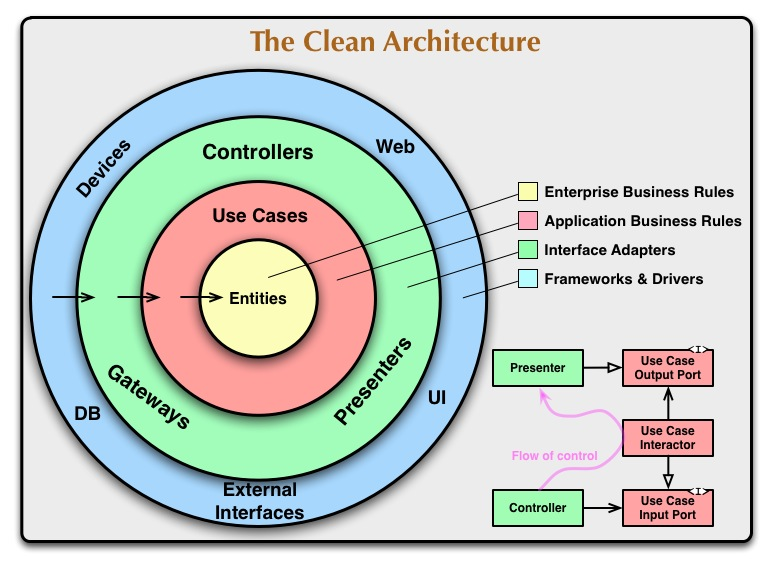
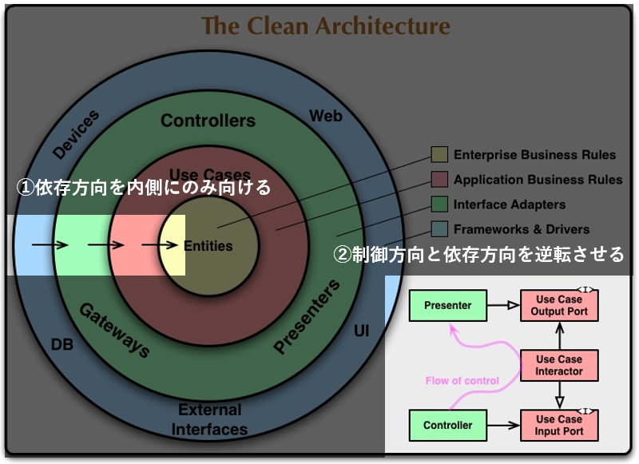
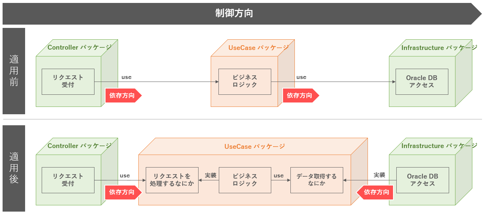
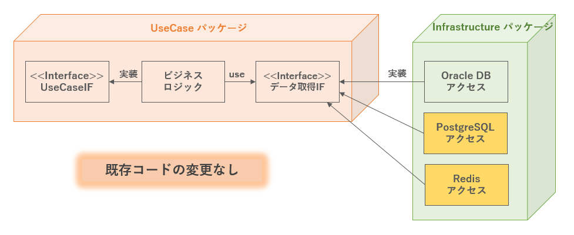
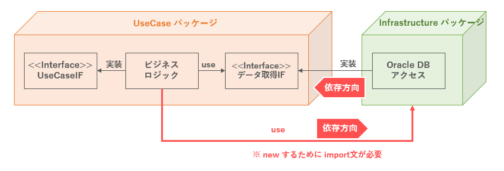
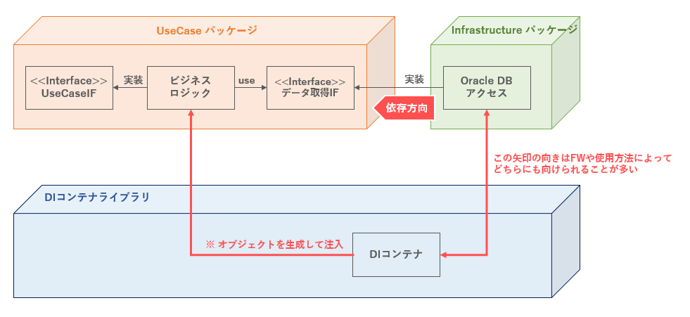

# クリーンアーキテクチャ解説

クリーンアーキテクチャは **「変更に強い」** プログラム構成及び設計原則である。

<br>

<br>
図. クリーンアーキテクチャ概要図  
引用：https://blog.cleancoder.com/uncle-bob/2012/08/13/the-clean-architecture.html

<br>
<br>

## 1. クリーンアーキテクチャのプログラム構成
クリーンアーキテクチャでは、以下のレイヤー分割ルールをベースに、プログラムを構成する。

<br>

| レイヤー名 | 役割詳細 |
| :--- | :--- |
| Enterprise<br> Business Rules | ビジネスルールが実装されるコアレイヤー |
| Application<br> Business Rules | 個々のビジネスルールを組み合わせたアプリケーションとしてのルールが実装されるコアレイヤー |
| Interface Adapters | 外部との入出力を適合させる処理が実装される詳細レイヤー |
| Frameworks & Drivers | フレームワークや実際のDB、外部ライブラリなどの詳細レイヤー |

<br>
<br>

## 2. クリーンアーキテクチャの設計原則

上図で表現されている考え方を文章に起こすと、以下のような設計原則になる。

1. **依存方向を内側に向ける**  
ビジネスルールやアプリケーションルールは外部要因（フレームワークやDBなど）の影響を受けないようにする。あくまでビジネスルールやアプリケーションルールを骨格と考え、それ以外の外部要因は後から変更可能な詳細と位置付ける。  
これが実現できていれば、レイヤーの数は重要ではなく、3層でも5層でも良い。

2. **制御方向と依存方向を逆転させる**  
制御の方向としては Controller → UseCase → (Domain) → Infrastructure のような流れになる。
しかし、設計原則1 「**依存方向を内側に向ける** 」 を実現するためにUseCaseやDomainがInfrastructureに依存してはいけない。

<br>

<br>
図. クリーンアーキテクチャ設計原則

<br>


## 3. 設計原則を実現するための **「依存性逆転の原則」**
**「制御方向と依存方向を逆転させる」** ことを **「依存性逆転の原則（Dependency Inversion Principle：DIP）」** という。これは **SOLID原則** と言われるソフトウェア設計（特にオブジェクト指向言語）の５大原則のうちの１つに数えられる重要な原則である。**「制御の反転（Inversion of Controll：IoC）」** といわれることもある。

以下に、依存性逆転の原則の適用前後のレイヤー間の依存関係を示す。

<br>

<br>
図. 依存性逆転の原則適用前後

<br>

上図のようにすることで、ビジネスロジックは「Oracle DB アクセス」に依存しないようになる。ビジネスロジックが依存するのは「データ取得するなにか」という抽象になる。

「データ取得するなにか」という抽象こそが、オブジェクト指向言語におけるインターフェースである。

抽象的にしておくことで、OracleがPostgreSQLに変更される場合や、RDBからKVSに変更される場合にも、ビジネスロジックに変更を加えず対応が可能となる。具象部分（実装クラス）を付け替えるだけである。

<br>

<br>
図. クリーンアーキテクチャ適用におけるDBの変更対応

<br>
<br>


> **「依存する」** とは
> 
> アプリケーションにおける依存性とは、**「相手を知っておく必要がある」** 状態を指します。
> 相手に依存しているとき（＝相手を知っておく必要がある状態のとき）には、相手の参照先／接続先／インターフェース仕様などが変わると、自分のアプリケーションもプログラムや設定ファイルの変更が必要になります。
> <br>
> <br>
> 具体例として、以下の行為は依存関係を生じます。
> - Javaのコード内にimport文を書く（C#ならusing文／各言語に合わせて読み替え）
> - アプリケーションの設定ファイルに接続先を書く（もちろんハードコーディングしていても同様）
>
> このような行為を行う場合には、一度立ち止まって、依存関係に問題がないかを考慮することを推奨します。
> <br><br>

<br>
<br>


## 4. 「依存性逆転の原則」を実現するための **「依存性注入」** 
「依存性逆転の原則」の概念を理解しても、素直に実装すると、依存性を排除できないことに気付く。

<br>

```java
import usecase.FetchInterface;      // UseCase層のデータ取得インターフェース
import infrastructure.OracleAccess; // Infrastructure層のOracleDBアクセス
// ↑↑↑ import文にOracleAccessが入ってしまっている ↑↑↑

public class UseCaseImplement {

  public void execute() {

    // （省略）

    FetchInterface fetchInterface = new OracleAccess();
    var data = fetchInterface.fetch();

    // （省略）

  }

}
```

<br>

<br>
図. `new` するための依存

<br>


ここで問題になるのが、`new` するために import文を書いて参照する必要がある点である。  
逆に、`new` する必要がなければimport文も必要なくなり、「依存性逆転の原則」を実現できることになる。

これを実現するのが、**「依存性注入（Dependency Injection：DI）」** である。

DIは、**予めDIコンテナという依存関係を管理する機構に依存関係を登録し、実行時に自動的にオブジェクトの生成を行うことで、依存性を実行時に注入する（＝コードから依存性を排除する）仕組み** のことである。（詳細は各自で調査／学習いただきたい。）

DIを使用した場合、コードは以下のようになる。

<br>

```java
import usecase.FetchInterface;      // UseCase層のデータ取得インターフェース

public class UseCaseImplement {

  // プライベートメンバ
  private FetchInterface fetchInterface;

  // コンストラクタ
  public UseCaseImplement(FetchInterface injected) {

    // injectedにはDIによってOracleAccessクラスがDIされる
    this.fetchInterface = injected;

  }

  public void execute() {

    // （省略）

    var data = this.fetchInterface.fetch();

    // （省略）

  }

}
```

<br>

コードからは`new`およびimport文が消え、infrastructure.OracleAccessへの依存が排除されたことがわかる。

DIコンテナを含む依存関係としては、以下のようになる。

<br>

<br>
図. DIによる依存性の注入

<br>

DIは依存性逆転の原則、ひいてはSOLID原則を実現するための非常に重要な技術要素である。 

DIフレームワークの先駆けとして有名なのは、**Spring** である。  
その後、Javaや.NETでも標準ライブラリとしてサポートしている。  
フロントエンドではAngularがデフォルトでDI機能を提供している。  
Pythonなどの他言語でもライブラリが存在していたり、ある程度の規模を想定したフレームワークではDIコンテナが標準で提供されていることが多い。

このような状況からも、依存性逆転の原則やDIコンテナを利用することの意義を理解することの重要性は感じとれる。
